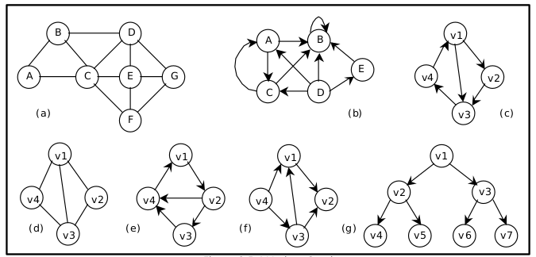
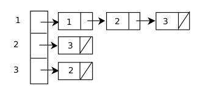

# Graphs

Graph is a pair (V, E) where V is a finite set of vertices and E is a finite set of edges.

Examples of graphs:

An edge with an orientation is a directed edge, while an edge with no orientation is an undirected edge.
If all the edges in a graph are undirected then the graph is an undirected graph.

## Representation of Graphs

There are two ways of representing graphs with code:

-   Adjacency matrix
-   Adjecency list

### Matrix

1 if there is an edge from Vi to Vj

0 otherwise

In case of a weighted graph then the entries are the weight of the edges.

### List

In this representation, the n rows of the adjacency matrix are represented as n linked lists. An array Adj[1, 2, . . . . . n] of pointers where for 1 < v < n, Adj[v] points to a linked list containing the vertices which are adjacent to v (i.e. the vertices that can be reached from v by a single edge). If the edges have weights then these weights may also be stored in the linked list elements.

## Traversing a Graph

There are two standard ways to traverse a graph:

-   Breadth first search (BFS)
-   Depth first search (DFS)

BFT will use a queue as an auxiliary structure to hold nodes for future processing and DFT will use a stack. Both auxiliary datastructures can be represented as arrays.

### BFT

Using the adjecency list method, an array to keep track of the visited nodes and a queue:

-   Create a queue
-   Mark the start node as visited
-   Enqueue the node
-   While there's something in the queue:
    -   get the current vertex by dequeueing
    -   print the curren vertex
    -   get its neighbors in the adjecency list
    -   while there are neighbors:
        -   check if the neighbor has been visited:
            -   if no then mark it as visited and enqueue it
            -   otherwise move to the next node

### DFT

For the sake of simplicity I am going to use a simple array to keep track of visited nodes (0 or 1 values).

Using the adjecency list method and an array to keep track of the visited nodes in a graph:

-   Get a node and its "neighbors" list (`graph->adjList[givenVertex]`)
-   Mark that node as visited in the visited array
-   While theres a node in the neighbors list:
    -   check if the next node has already been visited
        -   if no then call `DFS()` again on that node
        -   otherwise move to the next node
-   Clean the visited array by re-assigning 0s to the nodes
