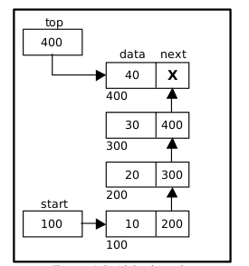

## Stack

A stack is a list of elements in which an alement may be inserted or deleted only at one end, called the top of the stack. Stacks are known as LIFO (last int, first out) lists.

### Operations

-   Push: insert an element into the stack
-   Pop: delete an element from a stack

All insertions and deletions take place at the same end, so the last element added to the stack will be the first element removed from the stack. When a stack is created, the stack base remains fixed while the stack top changes as elements are added and removed. The most accessible element is the top and the least accessible element is the bottom of the stack.

### Representation

Let us consider a stack with 6 elements capacity. This is called as the size of the stack.
The number of elements to be added should not exceed the maximum size of the stack.
If we attempt to add new element beyond the maximum size, we will encounter a stack overflow condition. Similarly, you cannot remove elements beyond the base of the stack. If such is the case, we will reach a stack underflow condition.

```
--------
4       |
--------
3       |
--------
2       |
--------
1       |
--------
0       | TOP
--------
Empty

### INSERTING ###

--------
4       |
--------
3       |
--------
2       |
--------
1       | TOP
--------
0   X   |
--------

### INSERTING ###

--------
4       |
--------
3       |
--------
2       | TOP
--------
1   Y   |
--------
0   X   |
--------
```

```
--------
4       |
--------
3       |
--------
2       | TOP
--------
1   Y   |
--------
0   X   |
--------

### DELETING ###

--------
4       |
--------
3       |
--------
2       |
--------
1       | TOP
--------
0   X   |
--------

### DELETING ###

--------
4       |
--------
3       |
--------
2       |
--------
1       |
--------
0       | TOP
--------
Empty
```

### Implementation

We could potentially implement a stack using arrays but I will implement it with a linked list.



## Queue

A queue is another special kind of list, where items are inserted at one end called the rear and deleted at the other end called the front. Another name for a queue is a “FIFO” or “First-in-first-out” list.

### Operations

-   enqueue: inserts an element at the end of the queue
-   dequeue: delets an element at the start of the queue

### Representation

```

  0     1     2     3     4
----|-----|-----|-----|-----|
    |     |     |     |     |
----|-----|-----|-----|-----|
FL

### INSERTING ###

  0     1     2     3     4
----|-----|-----|-----|-----|
  X |     |     |     |     |
----|-----|-----|-----|-----|
F      L

  0     1     2     3     4
----|-----|-----|-----|-----|
  X |  Y  |     |     |     |
----|-----|-----|-----|-----|
F            L


### DELETING ###

  0     1     2     3     4
----|-----|-----|-----|-----|
  X |  Y  |  Z  |     |     |
----|-----|-----|-----|-----|
F                  L


  0     1     2     3     4
----|-----|-----|-----|-----|
    |  Y  |  Z  |     |     |
----|-----|-----|-----|-----|
       F           L


  0     1     2     3     4
----|-----|-----|-----|-----|
    |     |  Z  |     |     |
----|-----|-----|-----|-----|
             F     L
```

### Implementation

Just like stacks, queues could be implemented using arrays but I will use a linked list.


